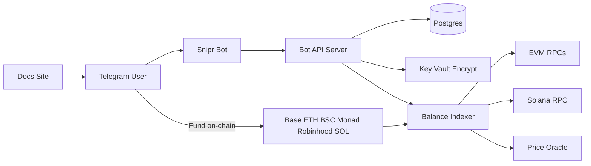

# Memecoin Telegram Sniper — First Draft (Phase 1)

**Status:** Draft v1 — product name TBD (placeholder: **Snipr**)  
**Goal:** Clawd-like UX — 4 taps from start to activate. No signup. No API keys.  
**Trade target (later):** Memecoins on DEXes  
**This phase:** UX + wallets + funding gate + Activate + docs site. **No live trading yet.**

---

## User journey (4 buttons)

1. Find the bot on Telegram → tap **Start**
2. Tap **Generate New Wallet** (bot creates EVM + Solana keys; user can export)
3. Fund with **≥ $100** in one of the six supported assets
4. Tap **Activate Bot** → agent is armed (Phase 2 starts trading)

No account signup. Identity = Telegram user id.

---

## Supported funding networks (from reference screenshots)

| Network    | Asset | Address type |
|------------|-------|--------------|
| Base       | ETH   | EVM (shared) |
| Ethereum   | ETH   | EVM (shared) |
| Binance    | BNB   | EVM (shared) |
| Monad      | MON   | EVM (shared) |
| Robinhood  | ETH   | EVM (shared) |
| Solana     | SOL   | SOL          |

One EVM deposit address covers the five EVM chains. One SOL address for Solana.  
Minimum portfolio USD value to unlock Activate: **$100**.

---

## Phase 1 scope (build now)

### Telegram bot
- `/start` welcome + feature copy (trailing TP messaging, no sub, no API key)
- Inline/reply keyboard:
  - Transfer | Deposit
  - Import a Wallet | Export Private Key
  - Generate New Wallet
- Wallet generate (fresh EVM + SOL keypairs)
- Encrypted private-key storage at rest; Export shows keys after confirm
- Import wallet (paste private key) — Phase 1 stub OK
- Portfolio message: balances for all 6 networks + Total USD
- Deposit addresses displayed
- Promo line (e.g. 48h no fees) — config flag
- Funding watcher: poll balances, USD price feed, unlock Activate at ≥ $100
- **Activate Bot** sets `agent_status = armed` (no trades in Phase 1)
- Links: Website | Docs | Channel

### Docs / marketing site
- Landing page (brand placeholder, CTA to Telegram bot)
- Docs: how it works, 4-step instructions, supported chains, fees, risks, FAQ
- Mobile-friendly

### Explicitly out of Phase 1
- Live memecoin snipes / DEX swaps
- Dynamic stop-loss / trailing take-profit execution
- Fee collection / promo enforcement on-chain
- Admin dashboard
- Mobile app

---

## Phase 2 (next, after Phase 1 works)

- Mempool / new-pool listeners (Uniswap v2/v3-style on EVM; Raydium/Pump.fun-style on Solana — exact venues TBD)
- Buy execution from user wallet
- Dynamic stop-loss + **trailing take-profit**
- Trade notifications in Telegram
- Withdraw / Transfer hardened flows
- Fee model after 48h promo

---

## Proposed architecture



| Piece | Choice |
|-------|--------|
| Bot framework | TypeScript + grammY |
| DB | PostgreSQL |
| Key encryption | AES-256-GCM with server master key |
| EVM | viem |
| Solana | @solana/web3.js |
| Prices | CoinGecko or similar (ETH/BNB/SOL/MON) |
| Docs site | Astro static site |
| Deploy (later) | Docker Compose → VPS or Fly/Railway |

**Custody model (matches reference bot):** server generates and stores encrypted keys; user can Export. This is convenient but high-risk — document clearly; harden before any real funds at scale.

---

## Repo layout

```
memecoin-sniper/
  FIRST_DRAFT.md          ← this file
  WHAT_I_NEED_FROM_YOU.md ← your checklist
  README.md
  apps/bot/               ← Telegram bot
  apps/web/               ← Docs / landing
  packages/shared/        ← chains, types, constants
  docker-compose.yml
  .env.example
```

**Keep separate from Big-Brain-Ape:** this folder is the product. Create a new empty GitHub repo when ready; we will move this tree to be the repo root.

---

## Success criteria for Phase 1

- New Telegram user can complete Start → Generate → see addresses → Deposit copy → balances update → Activate when ≥ $100
- Docs site explains the same 4 steps
- No live trading code paths yet
- Placeholder brand swapable via `BOT_NAME` / env
